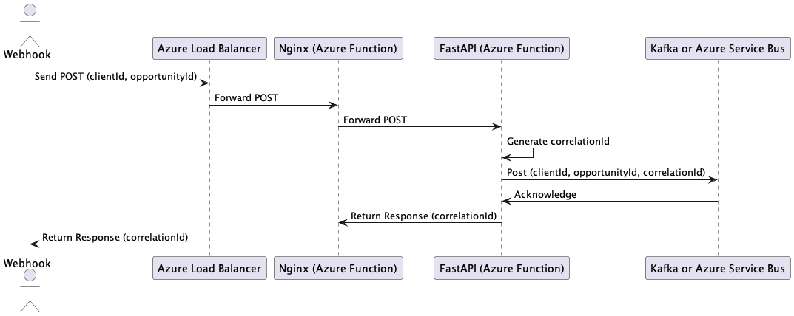
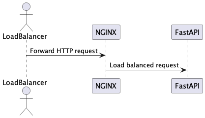
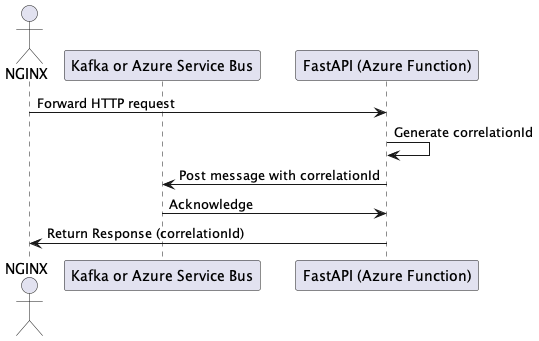

# poc-azure-architecture-for-webhooks

## Description

This project is a proof of concept (POC) for an Azure infractructure deployment that has a Webhook receiver application that interacts with Azure services. The application uses Azure services such as Azure Load Balancer, Azure Functions, and Azure Kafka or Azure Service Bus, to capture, store and retrieve data, to be process by downstream custom applications.

To build this Azure infrastructure, we will combine several key components: Azure Load Balancer, NGINX Docker containers hosted as Azure Functions, FastAPI web containers, and integration with Azure Kafka or Service Bus for message queuing. Below is a breakdown of the required setup, configuration files, and Azure DevOps scripts.

## Architecture

1. Azure Load Balancer: Acts as the entry point to receive HTTP POST requests with clientId and opportunity fields.
2. NGINX in Docker: Hosted on Azure Functions, this acts as a reverse proxy to route traffic to FastAPI containers. It should be scaled dynamically based on traffic.
3. FastAPI in Docker: This handles the incoming webhook requests, processes the payload, generates a correlationId, and forwards it to Kafka or Azure ServiceBus.
4. Kafka or Azure ServiceBus: These services act as a message queue to store and process the webhook requests.
5. Azure DevOps: Used to automate the deployment of the infrastructure and services.

## Step 1: NGINX Docker Setup

### Directory Structure

```
nginx-docker/
├── Dockerfile
├── nginx.conf
├── azure-function/
│   └── function.json
└── devops/
    └── deploy-nginx.yml
```

### Dockerfile for NGINX

```dockerfile
FROM nginx:latest
COPY ./nginx.conf /etc/nginx/nginx.conf
EXPOSE 80
```

### nginx.conf (NGINX Configuration)

```nginx
worker_processes auto;
events {
    worker_connections 1024;
}
http {
    upstream fastapi_backend {
        least_conn;
        server fastapi1:8000;
        server fastapi2:8000;
    }

    server {
        listen 80;
        location / {
            proxy_pass http://fastapi_backend;
            proxy_set_header Host $host;
            proxy_set_header X-Real-IP $remote_addr;
            proxy_set_header X-Forwarded-For $proxy_add_x_forwarded_for;
            proxy_set_header X-Forwarded-Proto $scheme;
        }
    }
}
```

This configuration load balances requests across FastAPI instances.

## Azure Function for NGINX (as a Docker container)

You will use Azure Functions Premium Plan to deploy NGINX as a container. The Azure Function's function.json file would look like this:

```json
{
  "bindings": [
    {
      "name": "req",
      "type": "httpTrigger",
      "direction": "in",
      "authLevel": "function",
      "methods": ["post"]
    },
    {
      "name": "$return",
      "type": "http",
      "direction": "out"
    }
  ]
}
```

## Step 2: FastAPI Docker Setup

### Directory Structure

```css
fastapi-docker/
├── Dockerfile
├── app/
│   ├── main.py
│   └── requirements.txt
└── devops/
    └── deploy-fastapi.yml
```

### Dockerfile for FastAPI

```dockerfile
FROM python:3.9-slim

WORKDIR /app
COPY . /app
RUN pip install --no-cache-dir -r requirements.txt
EXPOSE 8000
```

### requirements.txt

```txt
fastapi
mangum
kafka-python  # or azure-servicebus if you choose to use ServiceBus
```

### FastAPI Application with Mangum (main.py)

```python
from fastapi import FastAPI, Request
import uuid
from mangum import Mangum
from kafka import KafkaProducer

app = FastAPI()

producer = KafkaProducer(bootstrap_servers=['localhost:9092'])

@app.post("/webhook")
async def handle_webhook(request: Request):
    body = await request.json()
    client_id = body.get("clientId")
    opportunity = body.get("opportunity")

    # Generate correlationId
    correlation_id = str(uuid.uuid4())

    # Create message
    message = {
        "clientId": client_id,
        "opportunity": opportunity,
        "correlationId": correlation_id
    }

    # Send message to Kafka or Azure ServiceBus
    producer.send('webhook_topic', value=bytes(str(message), 'utf-8'))

    return {"status": "Message sent", "correlationId": correlation_id}

# Mangum handler for Azure Functions
handler = Mangum(app)
```

## Step 2.a: Azure Service Bus vs. Kafka

You can use Azure Service Bus as an alternative to Kafka if you prefer a fully managed solution by Azure. Azure Service Bus provides reliable messaging capabilities, integrated with other Azure services. It’s advantageous if you are building event-driven architectures and need transactional processing with better security and support.

```bash
az servicebus namespace create --name <namespace-name> --resource-group <resource-group> --location <location>
az servicebus queue create --resource-group <resource-group> --namespace-name <namespace-name> --name <queue-name>
```

You can modify the FastAPI application to send messages to Azure Service Bus instead of Kafka:

```python
from azure.servicebus import ServiceBusClient, Message

servicebus_client = ServiceBusClient.from_connection_string("<connection-string>")
queue_client = servicebus_client.get_queue_sender(queue_name="<queue-name>")

@app.post("/webhook")
async def handle_webhook(request: Request):
    body = await request.json()
    client_id = body.get("clientId")
    opportunity = body.get("opportunity")

    # Generate correlationId
    correlation_id = str(uuid.uuid4())

    # Create message
    message = {
        "clientId": client_id,
        "opportunity": opportunity,
        "correlationId": correlation_id
    }

    # Send message to Azure Service Bus
    message = Message(str(message))
    await queue_client.send_messages(message)

    return {"status": "Message sent", "correlationId": correlation_id}
```

### Note on Scaling & Failover

- Azure Functions' Premium Plan allows auto-scaling of Docker containers. If a FastAPI container crashes, a new one will automatically be provisioned.
- Use Azure Application Insights to monitor the health of FastAPI instances. Alerts can trigger container restarts.
- The FastAPI application should be designed to be stateless and scalable.

## Step 3: Kafka vs Azure ServiceBus

- Kafka: Low latency, high throughput. Good for real-time applications where you expect high message volume.
- Azure ServiceBus: More reliable with advanced messaging features such as message ordering, retries, and dead-lettering.

In this case, Azure ServiceBus is a better fit for managing queueing between FastAPI and downstream services.

## Step 4: Azure DevOps Pipeline

### deploy-nginx.yml (for NGINX)

```yaml
trigger:
  branches:
    include:
      - master

pool:
  vmImage: "ubuntu-latest"

steps:
  - task: Docker@2
    inputs:
      command: build
      repository: "nginx-docker"
      Dockerfile: "nginx-docker/Dockerfile"
      tags: "nginx:$(Build.BuildId)"

  - task: AzureFunctionAppContainer@1
    inputs:
      azureSubscription: "<your-azure-subscription>"
      appName: "<nginx-azure-function-name>"
      package: "$(System.DefaultWorkingDirectory)/nginx-docker"
      registry: "<your-docker-registry>"
      imageName: "nginx"
      imageTag: "$(Build.BuildId)"
```

### deploy-fastapi.yml (for FastAPI)

```yaml
trigger:
  branches:
    include:
      - master

pool:
  vmImage: "ubuntu-latest"

steps:
  - task: Docker@2
    inputs:
      command: build
      repository: "fastapi-docker"
      Dockerfile: "fastapi-docker/Dockerfile"
      tags: "fastapi:$(Build.BuildId)"

  - task: AzureFunctionAppContainer@1
    inputs:
      azureSubscription: "<your-azure-subscription>"
      appName: "<fastapi-azure-function-name>"
      package: "$(System.DefaultWorkingDirectory)/fastapi-docker"
      registry: "<your-docker-registry>"
      imageName: "fastapi"
      imageTag: "$(Build.BuildId)"
```

## Step 5: UML Diagrams Using PlantUML

The UML diagram was created with a plugin called "PlanUML" which is a free for MS Code, PyCharm or intelliJ

- The UML diagram was created with a plugin called "PlanUML" which is a free for MS Code, PyCharm or intelliJ

# [More UML documentation here at](https://plantuml.com/sequence-diagram)

### Main Architecture Diagram



### NGINX Setup Diagram



### FastAPI Setup Diagram



This architecture allows for scalable NGINX and FastAPI components that handle webhooks, auto-scale based on traffic, and integrate with Kafka or Azure ServiceBus for downstream communication. The Azure DevOps pipelines ensure the system is automatically deployed and maintained in Azure.
